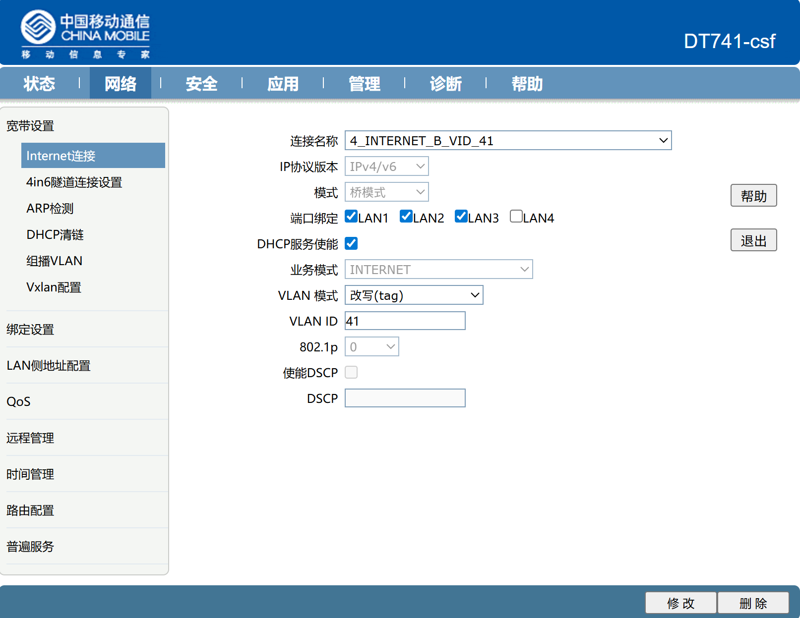
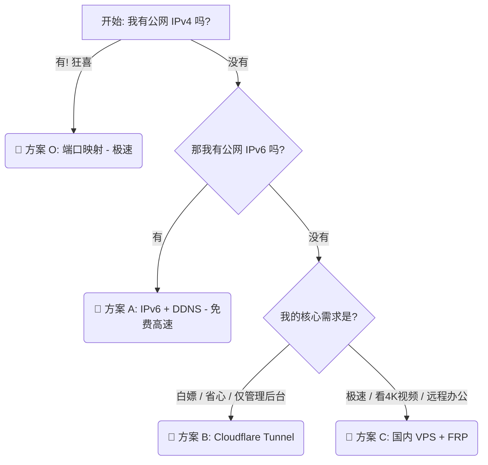

# 第二章：网络篇 —— 穿透内网，连接世界

> **摘要**：NAS 如果只能在家里用，那它只是一个大号硬盘。本章将手把手教你如何打破局域网的束缚，在没有公网 IPv4 的严峻环境下，利用 IPv6 和内网穿透技术，实现全球任意地点高速访问你的数据中心。

---

## 2.1 网络环境诊断：由于你根本没有公网 IPv4

在开始折腾之前，你需要认清一个残酷的现实：**在 2026 年，家用宽带几乎不再提供公网 IPv4 地址**（电信、联通部分老用户除外，移动宽带更是从来没有过）。

### 🔍 如何自测？

打开你的路由器后台查看 WAN 口 IP，去百度搜索“IP”，对比两个地址：

* **情况 A**：两个 IP 一致 -> 恭喜，你是天选之子（拥有公网 IPv4），请直接跳过 2.3 节 ipv6 配置。
* **情况 B**：路由器显示 `10.x.x.x` 或 `100.x.x.x`，百度显示另一个地址 -> **这就是大内网 (NAT)**。你被困在运营商的局域网里。

### 🚀 2026 年的主流解法

针对 NAS 玩家不同的使用场景（速度、管理、建站、分享），以下是四种主流方案的特质总结：

### 📊 快速决策表

| 方案             | 核心特质       | 速度表现            | 成本/门槛         | 最佳适用场景                             |
| :--------------- | :------------- | :------------------ | :---------------- | :--------------------------------------- |
| **1. IPv6**      | **直连首选** 🚀 | ⭐⭐⭐⭐⭐ (跑满带宽)    | 低 (需光猫改桥接) | 远程看 4K 电影、PT 下载、大文件传输      |
| **2. SD-WAN**    | **私密管理** 🛡️ | ⭐⭐⭐ (取决于打洞)    | 极低 (零配置)     | 远程管理后台 (DSM/QTS)、SSH、SMB 挂载    |
| **3. CF Tunnel** | **网页服务** 🌐 | ⭐⭐ (海外中转)       | 低 (需域名)       | 搭建个人博客、图床、轻量 Web 应用        |
| **4. frp / nps** | **公网分享** ⚡ | ⭐⭐⭐⭐ (稳定/受限VPS) | 高 (需购买 VPS)   | 分享文件给**他人**、游戏联机、全协议覆盖 |

---

### 📝 详细特质解析

### 1. IPv6 (直连首选)
>
> **"相当于把 NAS 直接插在互联网上。"**

* **核心优势**：**速度最快**。没有中间商赚差价，直接跑满家庭宽带的上行带宽（通常 30M-100M+），且完全免费。
* **适用场景**：
  * Plex / Emby / Jellyfin 远程播放高码率视频。
  * 异地大文件同步。
* **局限性**：
  * 公司或酒店的WiFi网络可能不支持 IPv6，导致无法连接回家。
  * IP 地址会变，必须配置 DDNS（动态域名解析）。

### 2. Tailscale / ZeroTier (私密管理)
>
> **"随身携带的一根虚拟网线。"**

* **核心优势**：**最安全且零配置**。无需公网 IP，无需在路由器开端口（防扫描、防勒索病毒）。数据点对点加密。
* **适用场景**：
  * 自己远程登录 NAS 后台修改配置。
  * 像访问本地硬盘一样访问 NAS 文件夹 (SMB)。
* **局限性**：
  * **双端限制**：访问端（手机/电脑）必须安装客户端软件，无法借用别人的电脑访问。

### 3. Cloudflare Tunnel (网页服务)
>
> **"把内网服务变成正规的 HTTPS 网站。"**

* **核心优势**：**无公网 IP 建站**。自带 SSL 证书，无需暴露任何本地端口。由 Cloudflare 的全球边缘节点提供安全防护。
* **适用场景**：
  * 对外发布导航页、博客、Wiki。
  * Docker 应用的 Web 界面访问（如 Portainer）。
* **局限性**：
  * 国内访问延迟高（流量需绕行海外）。
  * **禁止流媒体**：不适合跑大流量视频，容易被封号。

### 4. frp / nps (公网分享)
>
> **"借用云服务器的 IP 给家里开个门。"**

* **核心优势**：**高性能公开访问**。连接极其稳定，支持 TCP/UDP 全协议。可以将 NAS 的服务生成链接发给**没有任何软件的朋友**直接打开。
* **适用场景**：
  * 把 NAS 里的电影生成链接分享给微信好友。
  * 搭建 Minecraft / 帕鲁等游戏服务器。
* **局限性**：
  * **费钱**：必须购买有公网 IP 的 VPS。
  * **费心**：需要手写配置文件，有一定的 Linux 门槛。

---

### 💡 极客建议 (Combo 组合拳)

对于资深 NAS 玩家，建议采用 **"1 + 2"** 组合：

1. **日常主力**：配置 **IPv6 + DDNS**，享受极致速度。
2. **保底通道**：安装 **Tailscale**，当 IPv6 环境缺失或网络故障时，作为备用的管理通道进入内网排查问题。

---

## 2.2 核心前置：光猫改桥接 (Bridge Mode)

无论你用 IPv4 还是 IPv6，**光猫改桥接**都是获得稳定网络的第一步。

* **路由模式 (默认)**：光猫拨号。性能差，NAS 处于两层 NAT 下，不仅穿透困难，高负载下载还容易死机。
* **桥接模式 (推荐)**：路由器拨号。光猫只做光电转换，性能由你的高性能路由器释放。

### 🔴 关键准备：获取宽带账号与密码

在改桥接之前，你**必须**先拿到你的宽带拨号账号（通常是手机号或宽带号）和拨号密码。

> 💡 **提示**：如果忘记密码，直接打运营商客服重置密码。

### ⚔️ 方案 A：通过“装维师傅”修改

(最稳妥，但取决于师傅配合度)

直接联系装维师傅，明确表达：“我要改桥接模式，用自己的路由器拨号”。如果师傅配合，这是最省心的方案。

### 🛠️ 方案 B：硬核 DIY (获取超级密码)

如果师傅不配合，或者你喜欢自己动手，可以通过获取光猫的**超级管理员账户**（非光猫背后贴的普通 user 用户）来修改。

#### 1. 获取超级密码 🔐

联系装维师傅索要，若无法获取可直接去闲鱼 10 元左右破解获取。

#### 2. 进入后台修改 (关键步骤) ⚙️

1. **登录后台**
    浏览器访问光猫管理地址（通常是 `192.168.1.1`），使用 **超级管理员密码** 登录。

2. **定位设置**
    在顶部菜单找到 `网络 (Network)` -> `宽带设置 (WAN)`。

3. **选择 Internet 连接**
    在连接列表中，找到名称包含 `INTERNET_B_VID_xx` 的那一项（通常带有 VID 数值）。

4. **修改模式**
    * **连接模式**：从 `Route` (路由模式) 改为 **`Bridge` (桥接模式)**。
    * **IP 协议版本**：建议设置为 `IPv4/v6`。

> ⚠️ **切记：不要修改 VLAN ID (VID) 数值！**
> 必须保持该数值与原配置完全一致，否则改完后无法拨号上网。

1. **保存设置**
    点击底部的 **保存/应用** 按钮。



*💡 **Tips**：如果发现原连接是灰色的“无法编辑”状态，请先截图保存 VLAN ID 等参数，然后**删除**该连接，再按照桥接模式参数**新建**一个连接即可。*

---

### ✅ 最后一步：路由器拨号

光猫改好桥接后，你的设备暂时会断网，这是正常的。

1. 进入你的**主路由器后台** (ASUS / 中兴 / 小米等)。
2. 找到 **上网设置 (WAN设置)**。
3. 上网方式选择 **PPPoE (ADSL拨号)**。
4. 填入之前准备好的 **宽带账号** 和 **密码**。
5. **保存连接**。如果路由器 WAN 口获得了 IP 地址，即大功告成。

---

## 2.3 开启 IPv6：通往自由的钥匙

改完桥接后，我们需要在路由器上打通 IPv6 的通道。

### 2.3 路由器 IPv6 配置 (通用指南)

在光猫桥接模式下，路由器承担核心拨号任务。配置的核心逻辑分为两步：**对外获取 (WAN)** 与 **对内分发 (LAN)**。

#### 1. 核心配置参数

无论使用何种品牌的路由器，进入 **IPv6 设置** 页面后，请遵循以下通用标准进行配置：

| 配置项             | 推荐设置                       | 说明                                 |
| :----------------- | :----------------------------- | :----------------------------------- |
| **IPv6 开关**      | **开启**                       | -                                    |
| **上网方式 (WAN)** | **Native (原生)** 或 **PPPoE** | 严禁选择“桥接/Passthrough”或“NAT6”   |
| **前缀获取 (PD)**  | **开启 / 从运营商获取**        | 关键步骤，决定局域网设备是否有 IP    |
| **LAN 分配方式**   | **SLAAC (无状态)**             | 兼容性最佳，完美支持 Android/iOS/Win |

#### 2. 验证配置成功

配置保存后，请检查**电脑或手机**（非路由器后台）的网络详情：

> ✅ **成功标志**
>
> * 设备获取到 **`240` 开头** 的公网 IPv6 地址（通常会有 2 个，一个长久主地址，一个临时隐私地址）。
> * 访问 [test-ipv6.com](https://test-ipv6.com) 显示通过。
> ❌ **常见错误 (LAN 分配失败)**
>
> * 设备只有 `fe80::` 开头的地址，没有 `240` 开头的地址。
> * **原因**：WAN 口虽获取了 IP，但路由器未开启 LAN 口的前缀代理 (PD) 或 DHCPv6 服务。

### 2.3.2 关键步骤：防火墙放行 (Firewall)

**这是 99% 的新手失败的原因。**
有了 IPv6 地址，不仅意味着你能访问别人，也意味着别人能直接访问你。路由器为了安全，**默认会拦截所有从外网进入的 IPv6 请求**。

你必须在路由器中设置 **IPv6 防火墙** 或 **端口转发**，很多家用路由器无法单独配置，可以选择关闭或把防火墙级别调到最低。

> **⚠️ 运营商封锁警告**：
> 家庭宽带默认封锁 **80 (HTTP)** 和 **443 (HTTPS)** 端口。
> **切记**：外网访问时，必须使用 **非标端口**。

---

## 2.4 给 NAS 一个名字：DDNS (动态域名解析)

由于家用宽带的公网 IPv6 地址每隔几天就会变动，我们需要配置 DDNS，自动将最新的 IP 同步到你购买的域名上，实现通过 `nas.yourname.com` 随时高速直连。

### 2.4.1 准备工作：域名与密钥 (必做) 🔑

在配置 NAS 之前，你需要先在云服务商处完成“备货”：

1. **购买域名**：
    * 推荐 **阿里云 / 腾讯云 (DNSPod) / Cloudflare**。
    * 建议购买 `.top`, `.xyz` 等后缀，首年仅需几块钱。
2. **获取 API 密钥 (AccessKey)**：
    * 这是 NAS 修改域名解析记录的“通行证”。
    * **阿里云**：点击头像 -> `AccessKey 管理` -> 创建并保存 `AccessKey ID` 和 `Secret`。
    * **腾讯云**：点击头像 -> `访问管理` -> `API 密钥管理`。
    * **Cloudflare**：`My Profile` -> `API Tokens`。

---

### 2.4.2 方案一：系统原生 DDNS (推荐方案)

目前的 NAS 系统（如飞牛 fnOS、群晖 DSM 7.x）原生支持主流云厂商的 API，配置最简单，无需安装 Docker。

#### 1. 飞牛私有云 (fnOS)

* **入口**：`设置` -> `远程访问` -> `DDNS` -> `添加 DDNS`。
* **服务商**：选择你购买域名的厂商（如 Aliyun / Tencent）。
* **配置**：
  * 填入刚才获取的 ID 和 Secret。
  * **IPv6**：勾选（IPv4 不勾选）。
  * **网卡**：选择对应的物理网卡（确保该网卡已获取到 240 开头的地址）。
  * **域名**：填入完整域名 (如 `nas.marshall.top`)。

#### 2. 群晖 (Synology)

* **入口**：`控制面板` -> `外部访问` -> `DDNS` -> `新增`。
* **服务供应商**：
  * 腾讯云请选 `DNSPod.cn`。
  * 阿里云需确认列表是否有 `Aliyun`（部分旧版本需通过 Docker 或脚本实现）。
* **配置**：填入主机名称和密钥，确保 IPv6 地址更新正常。

---

### 2.4.3 方案二：DDNS-Go (Docker / 推荐方案) 🛠️

如果系统自带功能不支持你的域名商（例如 Cloudflare），或者你需要同时管理多个域名，**DDNS-Go** 是目前最强大、可视化的管理工具。

**1. 部署容器**
使用 SSH 连接 NAS，执行以下命令：

```bash
docker run -d \
  --name ddns-go \
  --restart=always \
  --net=host \
  -v /opt/ddns-go:/root/.ddns_go_config \
  jeessy/ddns-go
```

**2. 后台配置**

1. 浏览器访问 `http://NAS-IP:9876` 进入管理页面。
2. **DNS 服务商**：选择对应的厂商，填入 ID 和 Secret。
3. **IPv4**：**取消勾选**（移动大内网通常无公网 v4，启用会报错）。
4. **IPv6**：
    * **启用**：勾选。
    * **获取方式**：选择 **`通过网卡获取`**。
    * **网卡选择**：下拉选择 NAS 的物理网卡（包含 IPv6 地址的那一个）。
    * **Domains**：填入你的完整域名 (如 `nas.yourdomain.com`)。
5. **保存**：查看右侧日志，出现 `更新域名解析成功` 即大功告成。

> 💡 **验证成功**
>
> 配置完成后，在电脑终端执行以下命令：
>
> * **Windows**: `ping nas.yourdomain.com -6`
> * **Mac/Linux**: `ping6 nas.yourdomain.com`
>
> 如果能解析出 IP 且能 Ping 通，说明域名解析已生效。

## 2.6 备用方案：Tailscale (内网穿透)

如果你无法改桥接，或者在公司网络无法访问 IPv6，**Tailscale** 是最后的救命稻草。

1. **注册**：去 Tailscale 官网注册账号。
2. **NAS 端**：在 fnOS/Unraid 应用中心下载 Tailscale 并登录。
3. **手机/PC 端**：下载 App 并登录同一账号。
4. **连接**：开启 App 开关，你会获得一个 `100.x.y.z` 的内网 IP，直接访问即可。

* *优点*：零配置，极其安全。
* *缺点*：需要全端安装 App，传输大文件速度可能不如 IPv6 直连。

---

## 2.7 备用方案：Cloudflare Tunnel (零配置/安全/免费)

如果你处于公司内网、没有公网 IP，或者不想暴露家里真实的 IP 地址，**Cloudflare Tunnel (CF 隧道)** 是目前最优雅的解决方案。它利用“零信任 (Zero Trust)”技术，主动从你的 NAS 向 Cloudflare 边缘节点打通一条加密隧道。

* **优点**：无需公网 IP、无需光猫改桥接、自动续期 HTTPS 证书、隐藏源站 IP。
* **缺点**：国内访问速度取决于 Cloudflare 节点的连通性（晚高峰可能较慢），视频播放等大流量不建议使用。

### 🛠️ 第一步：前期准备

1. **账号**：注册一个 [Cloudflare](https://www.cloudflare.com) 账号。
2. **域名**：拥有一枚域名，并将 DNS 服务器修改为 Cloudflare 提供的地址（Nameservers）。
    * *提示*：在腾讯云/阿里云买的域名，需要去后台把 DNS 改成 CF 给你的（如 `amy.ns.cloudflare.com`）。

### 🛠️ 第二步：创建隧道 (Create Tunnel)

1. 进入 Cloudflare 后台，点击左侧边栏的 **Zero Trust**（首次进入需选择 Free 免费计划并绑定支付方式，不会扣费）。
2. 在 Zero Trust 面板中，点击 **Networks** -> **Tunnels**。
3. 点击 **Create a tunnel**。
4. **Connector**：选择 **Cloudflared**，点击 Next。
5. **Name**：起个名字，例如 `MyHomeNAS`，点击 Save Tunnel。

### 🛠️ 第三步：NAS 部署连接器 (Connector)

在 "Install and run a connector" 页面，你会看到一串代码。我们选择 **Docker** 环境。

1. **获取 Token**：
    复制命令中 `--token` 后面的那长串字符。

2. **在 NAS (fnOS/Unraid/群晖) 上运行**：
    打开 NAS 的 SSH 终端，运行以下命令（替换 `<你的TOKEN>`）：

    ```bash
    docker run -d \
      --name cf-tunnel \
      --restart always \
      cloudflare/cloudflared:latest tunnel --no-autoupdate run --token <你的TOKEN>
    ```

3. **验证状态**：
    回到 CF 网页，下方的 **Connectors** 列表应该会显示 `Connected` 状态。点击 Next。

### 🛠️ 第四步：配置访问域名 (Public Hostname)

这是最后一步，告诉 CF 哪个域名对应 NAS 里的哪个服务。

1. **Public Hostname** (你的外网域名)：
    * Subdomain: `nas` (或者 `emby`, `alist`)
    * Domain: 选择你的域名 (如 `example.com`)
2. **Service** (你的局域网地址)：
    * Type: `HTTP`
    * URL: `192.168.x.x:5000` (填写你 NAS 的内网 IP 和端口)
3. 点击 **Save Tunnel**。

🎉 **完成！** 现在访问 `https://nas.example.com`，即可直接连回家里的 NAS，且自带安全的小绿锁。

---

## 2.7 备用方案：国内云主机 + FRP (土豪版/极速/低延迟)

如果你对**速度**和**延迟**有极致要求（例如：远程流畅拖拽 4K 进度条、远程办公），且没有 IPv6 环境，那么购买一台国内的云服务器做中转是最佳选择。

* **原理**：`NAS (frpc)` <--> `云服务器 (frps)` <--> `你的手机/电脑`
* **成本**：需购买云服务器（推荐腾讯云/阿里云大促时的“轻量应用服务器”，约 ¥80-100/年）。

### 🛠️ 第一步：服务端配置 (云服务器)

假设你已经购买了一台腾讯云/阿里云的服务器，系统为 Ubuntu/Debian。

1. **放行防火墙 (安全组)**：
    * 去云厂商的网页控制台，找到 **防火墙/安全组**。
    * 放行端口：**7000** (FRP 通讯端口) 和 **8080** (Web 访问端口，可自定义)。

2. **安装 frps**：
    SSH 登录到云服务器，执行：

    ```bash
    # 下载 frp (以 v0.58.0 为例，请去 GitHub 查最新版)
    wget [https://github.com/fatedier/frp/releases/download/v0.58.0/frp_0.58.0_linux_amd64.tar.gz](https://github.com/fatedier/frp/releases/download/v0.58.0/frp_0.58.0_linux_amd64.tar.gz)
    
    # 解压并重命名
    tar -zxvf frp_0.58.0_linux_amd64.tar.gz
    mv frp_0.58.0_linux_amd64 frp
    cd frp
    ```

3. **修改配置文件 `frps.toml`**：

    ```bash
    nano frps.toml
    ```

    清空内容，粘贴以下配置：

    ```toml
    bindPort = 7000           # 服务端监听端口
    vhostHTTPPort = 8080      # 访问 Web 服务的端口
    auth.token = "MySecret123" # 通讯密钥，设复杂点！
    
    # 仪表盘 (可选，用于查看连接状态)
    webServer.addr = "0.0.0.0"
    webServer.port = 7500
    webServer.user = "admin"
    webServer.password = "admin123"
    ```

4. **后台运行**：

    ```bash
    ./frps -c frps.toml &
    # 注意：实际生产环境建议使用 systemd 或 nohup 保持后台运行
    ```

### 🛠️ 第二步：客户端配置 (NAS)

在 NAS (fnOS) 上，我们推荐使用 **Docker Compose** 来部署客户端，方便管理配置文件。

1. **创建配置文件**：
    在 NAS 的任意目录（如 `/vol1/1000/docker/frpc`）下新建 `frpc.toml`：

    ```toml
    serverAddr = "x.x.x.x"     # 云服务器的公网 IP
    serverPort = 7000          # 对应服务端的 bindPort
    auth.token = "MySecret123" # 必须与服务端一致
    
    # 配置穿透规则 1：NAS 管理页面
    [[proxies]]
    name = "nas-web"
    type = "http"
    localIP = "192.168.31.10"  # NAS 的局域网 IP
    localPort = 5000           # NAS 的服务端口
    customDomains = ["nas.yourdomain.com"]
    
    # 配置穿透规则 2：Qbittorrent
    [[proxies]]
    name = "qb"
    type = "http"
    localIP = "192.168.31.10"
    localPort = 8080
    customDomains = ["qb.yourdomain.com"]
    ```

2. **创建 `docker-compose.yml`**：

    ```yaml
    version: '3'
    services:
      frpc:
        image: snowdreamtech/frpc:latest
        container_name: frpc
        restart: always
        volumes:
          - ./frpc.toml:/etc/frp/frpc.toml
    ```

3. **启动容器**：
    在文件夹下运行 `docker-compose up -d`。

### 🛠️ 第三步：域名解析与访问

1. **解析**：去域名服务商，将 `nas.yourdomain.com` 和 `qb.yourdomain.com` 的 **A 记录** 都指向 **云服务器的公网 IP**。
2. **访问**：
    * 打开浏览器访问：`http://nas.yourdomain.com:8080`
    * 注意：因为我们没有配置 Nginx 反代 80 端口，所以必须带上 `vhostHTTPPort` 设置的端口号 (8080)。

> **💡 进阶技巧**：
> 如果不想带端口号访问，可以在云服务器上安装 **Nginx Proxy Manager**，将 80/443 端口转发到 8080 端口，即可实现 `https://nas.yourdomain.com` 直接访问。

---

## 2.8 决策指南：我该选哪一个？

为了治好你的选择困难症，请参考以下决策树：



> **👨‍💻 作者实战建议**：
>
> 1. **🚀 主力方案 (IPv6)**：
>     * **适用场景**：看 Plex/Emby 视频、远程下载文件。
>     * **理由**：这是唯一能跑满你家宽带上行带宽的免费方案，看 4K 电影不卡顿。
>
> 2. **🛡️ 备用方案 (Cloudflare)**：
>     * **适用场景**：管理 Portainer、SSH 终端、HomeAssistant。
>     * **理由**：当你在公司、酒店等 **不支持 IPv6 的网络环境** 时，或者 IPv6 突然抽风时，这条隧道就是你的“救命通道”，保证你随时能连回家。

---

## ✅ 本章小结

恭喜你！你已经打通了 NAS 的任督二脉。
现在，你的 NAS 已经不再是一个孤岛。

* **光猫**：桥接模式 ✅
* **路由器**：IPv6 开启 + 防火墙放行 ✅
* **域名**：DDNS 自动解析 ✅

网络通了，接下来就是让这台机器发挥真正的价值了。首先解决最让手机党头疼的问题：**照片满了怎么办？**

👉 **下一章：[备份篇 —— 苹果生态与数据归档](03-backup.md)**
