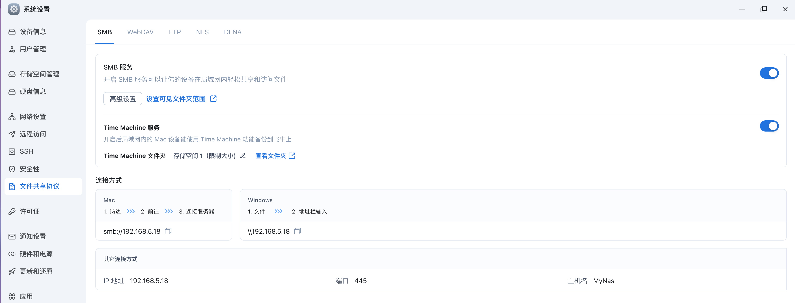

# 第三章：备份篇 —— 苹果生态与数据归档

> **摘要**：搭建 NAS 的核心动力往往源于“存储焦虑”。手机提示“空间已满”、MacBook 硬盘捉襟见肘……本章我们将构建一套**自动、无感、隐私**的备份系统，彻底释放你的设备空间，并给数据一颗“后悔药”。

---

## 3.1 MacBook Time Machine (时间机器) —— 给电脑一颗“后悔药”

**Time Machine** 是 macOS 最强大的功能之一。它能将电脑状态“快照”下来。误删文件？系统崩溃？换新电脑？一键时光倒流，瞬间恢复如初。
利用 NAS 的 SMB 协议，我们可以实现像 iCloud 一样的**无线静默备份**。

### 3.1.1 核心原理：SMB 与 vfs_fruit 优化

在旧版本中，Time Machine 依赖 AFP 协议，但现在 Apple 已全面转向 SMB。
为了让 NAS 的 SMB 协议完美兼容 macOS 的元数据（Metadata）并提升读写速度，我们可以开启 Samba 的 `vfs_fruit` 模块。这能让 Finder 操作 NAS 文件时像操作本地硬盘一样丝滑。

### 3.1.2 NAS 端配置 (服务端)

#### 第一步：创建专用账户 (安全隔离)

为了防止勒索病毒或误操作波及 NAS 里的电影和文档，**强烈建议**为时间机器创建一个单独的用户。

* **用户名**：`tm_user`
* **密码**：(设置一个复杂的密码)
* **权限**：只给予 Time Machine 共享文件夹的读写权限，禁止访问其他目录。

#### 第二步：创建共享文件夹与配额 (Quota) ⚠️

**这是 99% 新手翻车的地方！** Time Machine 默认会无限备份，直到把你的 NAS 硬盘彻底塞满，导致 Docker 报错、电影无法下载。
**必须设置配额！**

* **fnOS / 群晖 DSM 设置路径**：
    1. 设置 / 控制面板 -> 文件共享协议 -> 新增 `TimeMachine`。
    2. **配额设置**：勾选“启用配额限制”。
    3. **建议大小**：你的 Mac 硬盘容量 x 2 (例如 Mac 是 512G，配额设为 1TB)。
    4. **高级设置**：启用“文件压缩”和“完整性校验”（可选，牺牲速度换安全）。

#### 第三步：开启 Bonjour 与 SMB 广播

让 Mac 在局域网里能自动发现这台 NAS 是“备份磁盘”。

* **设置路径**：文件服务 -> SMB -> 高级设置。
* **操作**：
  * 勾选 **启用 Bonjour 服务发现**。
  * 勾选 **通过 SMB 进行 Time Machine 广播**。
  * 点击 **设置 Time Machine 文件夹**，选中刚才创建的 `TimeMachine`。

> **💡 Tips (飞牛OS)**：
> 直接在 **设置** -> **文件共享协议** 中打开 **Time Machine 服务** 即可。

<div align="center">
  
  <font size="2" color="gray">飞牛时间机器配置参考截图</font>
</div>

> **🐧 极客专区：Linux/OpenWrt 手搓配置**
> 如果你是手写 `smb.conf`，请添加以下针对 macOS 的优化参数：
>
> ```ini
> [TimeMachine]
>    path = /mnt/data/TimeMachine
>    valid users = tm_user
>    writable = yes
>    # 关键优化：开启 fruit 模块模拟 Apple 协议行为
>    vfs objects = catia fruit streams_xattr
>    fruit:time machine = yes
>    fruit:metadata = stream
>    fruit:encoding = native
>    # 限制最大空间 1TB
>    fruit:time machine max size = 1T
> ```

---

### 3.1.3 Mac 端配置 (客户端)

1. **连接**：打开 `系统设置` -> `通用` -> `时间机器`。
2. **添加**：点击 `添加备份磁盘`，选择你的 NAS。
3. **登录**：输入刚才创建的 `tm_user` 账号密码（**切记不要用管理员账号**）。
4. **排除**：点击 `选项`，排除 `Downloads` (下载) 和 `Parallels` (虚拟机) 等垃圾文件目录，节省空间。

---

## 3.2 原生方案：飞牛/群晖相册 + iOS 快捷指令 (真·无感备份)

如果你不想折腾 Docker，或者希望使用 NAS 系统自带的 AI 识图和相册管理功能，**飞牛相册 (fnOS Photos)** 或 **群晖 Photos**等是更省心的选择。
针对 iPhone 用户无法自动完成备份（需要打开 app），我们将利用 iOS 的“快捷指令”功能彻底解决它。

### 3.2.1 服务端：一键开启 (以飞牛为例)

原生相册的最大优势是**零配置**。

1. **开启服务**：打开飞牛桌面 -> `相册`，根据向导建立个人照片库。
2. **手机设置**：
    * 下载 `飞牛私有云` App。
    * 进入 `相册` -> 右上角头像 -> `手机备份`。
    * 开启 **自动备份**，选择“仅 Wi-Fi”和“备份 HEIC 为原图”。

### 3.2.2 客户端：iOS 快捷指令自动化  🍎

iOS 系统比较封闭，第三方相册 App 无法像 iCloud 一样后台自动完成备份。我们可以创建一个**“回家自动唤醒备份”**的自动化脚本，来实现无感备份。

**原理**：当手机在充电且连接到家里 Wi-Fi 时 -> 自动打开飞牛 App -> App 自动触发上传 -> 自动返回桌面。

#### 🛠️ 设置步骤

### 第一阶段：设置触发器 (Trigger)

1. 打开 **快捷指令 (Shortcuts)** App，点击底部中间的 **自动化 (Automation)**。
2. 点击右上角的 **+** 号，搜索并选择 **充电器 (Charger)**。
3. **关键设置**：
   * 勾选 **🟢 已连接**。
   * 勾选 **🟢 立即运行** (Run Immediately) <small>*(⚠️ 必选，否则无法自动执行)*</small>。
   * 关闭 **⚪️ 运行时通知**。
4. 点击 **下一步**，选择 **新建空白自动化**。

### 第二阶段：编写脚本 (Script Logic)

点击巨大的 **“添加操作”** 按钮或底部搜索栏，按顺序搜索并添加以下积木：

#### 1. 获取当前网络

* 🔍 搜索动作：`获取网络详细信息` (Get Network Details)
* ⚙️ 默认设置：获取 **Wi-Fi** 的 **网络名称**。

#### 2. 判断是否在家

* 🔍 搜索动作：`如果` (If)
* ⚙️ 设置条件：如果 **网络详细信息** <span style="color:blue">是</span> `[在此输入你家的Wi-Fi名称]`
  > *注意：Wi-Fi 名称区分大小写，必须完全一致。*

#### 3. 执行备份任务

*(⚠️ 请务必将以下动作拖入 “如果” 和 “否则” 之间)*

* 🔍 搜索动作：`打开 App`
  * 选择目标：**飞牛私有云**
  > *作用：强制唤醒 App 到前台，触发备份逻辑。*

* 🔍 搜索动作：`前往主屏幕` (Go to Home Screen)
  * *作用：备份完成后自动隐藏 App，不遮挡视线。*

* *(可选步骤)* 🔍 搜索动作：`锁定屏幕` (Lock Screen)
  * *作用：运行结束后自动黑屏，适合睡前插电场景。*

> **💡 效果演示**：
> 每天你下班回家连上 Wi-Fi，手机刚充上电，顶部就会弹出一个横幅：“飞牛自动备份中...”。
> 飞牛 App 会自动打开传输刚才拍的照片，然后乖乖退回后台。你完全不需要手动去点它，这才是真正的**无感备份**。

<div align="center">
  
  <font size="2" color="gray">iPhone快捷指令参考截图</font>
</div>

---

### 3.2.3 方案对比：Immich vs 原生相册

| 维度           | Immich (Docker)                | 飞牛/群晖原生相册                      |
| :------------- | :----------------------------- | :------------------------------------- |
| **部署难度**   | ⭐⭐⭐ (需懂 Docker/命令行)       | ⭐ (开箱即用)                           |
| **App 体验**   | 🚀 极度丝滑，媲美 Google Photos | 🟢 够用，持续更新后更加好用，偶尔有 Bug |
| **AI 识图**    | 🧠 极强 (支持搜索"红衣服的狗")  | 😐 基础 (人物/场景分类)                 |
| **Live Photo** | ✅ 完美支持                     | ✅ 支持 (飞牛支持较好)                  |
| **适用人群**   | 极客、对体验有极致要求的人     | 想要省心、不想维护容器的小白           |

> **👨‍💻 作者建议**：
> 如果你是 **fnOS** 用户，我强烈建议**先用原生的飞牛相册**。配合上面的快捷指令，体验已经能达到 90 分。只有当你觉得原生相册的功能实在满足不了你时，再尝试部署 Immich。

## 3.3 手机照片管理 (Immich 实战) —— 谷歌相册的完美替代

在 2026 年，**Immich** 已经毫无争议地成为了自托管相册的王者。它拥有媲美 Google Photos 的丝滑 App、支持 Live Photos (实况照片)、支持地图模式，并且自带强大的 AI 识图功能。

### 3.3.1 部署架构：Docker Compose

Immich 组件较多（数据库、机器学习容器、Web 服务等），必须使用 Docker Compose 部署。

**准备工作**：
在 NAS 上创建一个目录 `immich`，并下载官方的 `.env` 和 `docker-compose.yml` 文件。

**核心配置文件 (`docker-compose.yml`) 优化版**：
这里重点展示如何开启 **N100 核显加速**，用于 AI 识别和视频转码。

```yaml
version: '3.8'

services:
  immich-server:
    container_name: immich_server
    image: ghcr.io/immich-app/immich-server:release
    volumes:
      - ./upload:/usr/src/app/upload  # 照片存储路径
      - /etc/localtime:/etc/localtime:ro
    env_file:
      - .env
    ports:
      - 2283:3001
    depends_on:
      - redis
      - database
    restart: always
    # 🚀 开启 N100 核显硬件加速 (用于视频转码)
    devices:
      - /dev/dri:/dev/dri

  immich-machine-learning:
    container_name: immich_machine_learning
    # 💡 2026年建议开启 OpenVINO 加速 (Intel CPU 专用)
    image: ghcr.io/immich-app/immich-machine-learning:release
    volumes:
      - model-cache:/cache
    env_file:
      - .env
    restart: always
    # 🚀 开启 N100 核显加速 (用于 AI 识图)
    devices:
      - /dev/dri:/dev/dri

  redis:
    image: redis:6.2-alpine@sha256:70a7a...
    restart: always

  database:
    image: tensorchord/pgvecto-rs:pg14-v0.2.0@sha256:90724...
    environment:
      POSTGRES_PASSWORD: ${DB_PASSWORD}
      POSTGRES_USER: ${DB_USERNAME}
      POSTGRES_DB: ${DB_DATABASE_NAME}
    volumes:
      - pgdata:/var/lib/postgresql/data
    restart: always

volumes:
  pgdata:
  model-cache:
```

### 3.3.2 开启硬件加速与 AI 识图

部署完成后，进入 Immich 网页后台 `http://NAS-IP:2283`，我们需要激活 N100 的潜能。

1. **硬件转码 (Video Transcoding)**：
    * **位置**：点击右上角头像 -> `Administration` -> `Settings` -> `Video Transcoding`。
    * **配置**：
        * **Hardware Acceleration**: 勾选 `Enabled`。
        * **Acceleration API**: 选择 `VAAPI` 或 `QuickSync` (针对 N100 这种 Intel 核显)。
    * **效果**：当你上传 4K 视频时，NAS 会静默利用核显进行转码，浏览时即点即开，且 CPU 占用率极低。

2. **AI 智能识图 (Machine Learning)**：
    * **位置**：`Settings` -> `Machine Learning`。
    * **CLIP Model (图像识别模型)**：推荐选择 `XLM-Roberta-Large-Vit-B-16`。
        * *理由*：这个模型对多语言（尤其是中文）的支持最好。
    * **Facial Recognition (人脸识别)**：推荐 `Buffalo_L`。
    * **效果**：保存设置后，在搜索栏输入“睡觉的猫”、“去年的生日蛋糕”或“身份证”，AI 会瞬间从几万张照片里找到结果。

---

### 3.3.3 多用户策略：家庭隐私管理

Immich 的多用户逻辑非常清晰：**既能分享，又不泄露隐私**。

* **场景**：你要给老婆/父母备份照片，但不想让他们看到你手机里的“沙雕图”，同时又想共享宝宝的照片。
* **操作流程**：
    1. **创建用户**：管理员在 `Administration` -> `Users` 中为每个家庭成员创建独立账号。
    2. **独立图库**：每个人的照片默认是**私有**的，存储在物理隔离的文件夹中，互不可见。
    3. **共享相册 (Shared Albums)**：创建一个“家庭旅游”相册，把大家拍的照片手动添加进去，拥有链接或权限的家庭成员才能看到。
    4. **伴侣共享 (Partner Sharing)**：如果夫妻之间极其信任，可以开启此功能，对方可以看到你所有的照片（慎用！）。

---

### 3.3.4 手机端 App 设置

1. **下载 App**：App Store / Google Play 搜索 **Immich**。
2. **服务器地址 (Server URL)**：
    * **在家时**：建议填内网 IP `http://192.168.x.x:2283` (速度最快)。
    * **在外时**：填我们在第二章配置的域名 `https://photo.yourdomain.com` (需配合 SSL 证书)。
3. **后台备份技巧**：
    * **iOS**：受限于苹果的墓碑机制，建议开启 **"Background App Refresh" (后台应用刷新)**，并在 App 设置中开启 **"Upload only on Wi-Fi"**。
    * **Android**：必须在系统设置中将 Immich 的电池优化设为 **"Unrestricted" (无限制)**，即可实现真正的无感自动备份。

---

## ✅ 本章小结

现在，你的 NAS 已经接管了全家最重要的数据资产：

* **MacBook** 有了 Time Machine 护体，再也不怕系统崩溃。
* **手机照片** 全部安全回传到本地，Google Photos / iCloud 即使停用也毫无畏惧。
* **隐私** 得到了保障，每个人的数据都井水不犯河水。

数据存好了，接下来怎么用起来？让我们把这些冷冰冰的文件变成全家人的娱乐中心。

👉 **下一章：[影音篇 —— 打造自动化家庭影院](04-media.md)**
