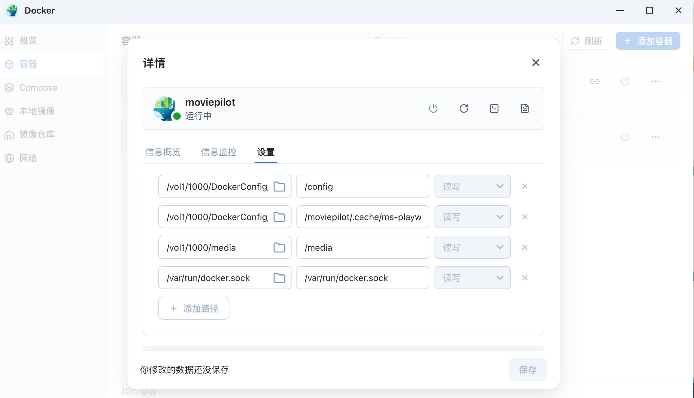

# 第四章：娱乐篇 —— 打造全能家庭媒体中心

> **摘要**：本章将把你的 NAS 进化为一个 24 小时工作的娱乐中枢。告别各种会员费，把数据掌握在自己手中。
>
> **🌟 本章目标**：
>
> 1. **🎬 影音自由**：通过 `qBittorrent` + `MoviePilot` 实现自动化追剧、下载、刮削，打造私人 Netflix。
> 2. **📺 全格式播放**：部署 `Jellyfin`，利用核显硬件解码，在外网也能流畅观看 4K HDR 蓝光电影。
> 3. **🎵 私人 Spotify**：部署 `Navidrome` 和 `Audiobookshelf`，管理无损音乐和有声书，支持手机端流媒体播放。
> 4. **📚 电子书库**：部署 `Calibre-Web`，将 NAS 变成你的私人 Kindle 书库，支持一键推送到阅读器。

---

## 4.1 影音基石：下载与自动化 (Video Freedom)

我们要实现的效果是：**你在手机上订阅一部电影，NAS 自动下载、自动改名、自动下载海报，然后通知你“可以看了”。**

### 4.1.1 黄金目录结构 (关键步骤) ⚠️

**这是自动化成功与否的基石**。为了让自动化软件能通过“硬链接 (Hardlink)”秒级整理文件且不占用双倍空间，目录结构必须规范。

1. **创建共享文件夹**：在 NAS 文件管理器中创建一个名为 `Media` 的顶级共享文件夹。
2. **建立子目录结构**：

    ```text
    /vol1/1000/Media
    ├── downloads          <-- [下载区] qBittorrent 只能读写这里
    │   ├── movies
    │   ├── tv
    │   └── anime
    └── librar            <-- [展示区] Jellyfin/Emby 读取这里
        ├── movies         <-- 自动整理后的电影 (硬链接)
        ├── tv             <-- 自动整理后的剧集 (硬链接)
        └── anime          <-- 自动整理后的动漫 (硬链接)
    ```

    > **💡 硬链接原理解析**：
    > 硬链接就像给同一个文件起了两个名字。
    > * 文件 A 在 `downloads` 文件夹（用于保种）。
    > * MoviePilot 在 `library` 文件夹创建了一个文件 B 指向同一个物理数据块。
    > * **删除 A，B 还在；删除 B，A 还在。** 只有 A 和 B 都删了，空间才释放。这让你既能保持 PT 做种，又能拥有完美的海报墙，且**不额外占用空间**。

### 4.1.2 下载中心：qBittorrent

**1. 应用安装**

根据您的需求选择以下任意一种安装方式：

**方案 A：飞牛 (fnOS) 应用中心安装（推荐）**
> 适合新手用户，操作简单，系统自动配置路径。

1. 登录飞牛桌面，打开 **应用中心**。
2. 在搜索栏输入 **qBittorrent**，点击 **安装**。
3. 等待安装完成后点击 **打开**，系统将自动跳转至 Web 管理后台。

**方案 B：Docker 命令行部署**
> 适合熟悉 Linux 的高阶用户，便于自定义版本和挂载路径。

请在 SSH 终端中执行以下命令（**注意**：请根据实际情况修改 `-v` 后的路径）：

```bash
docker run -d \
  --name=qbittorrent \
  --net=host \
  -e PUID=0 \
  -e PGID=0 \
  -e TZ=Asia/Shanghai \
  -e WEBUI_PORT=8080 \
  -v /vol1/1000/DockerConfig/qbittorrent:/config \
  -v /vol1/1000/Media/downloads:/downloads \
  --restart=always \
  linuxserver/qbittorrent:latest
```

### 2. 关键配置优化（解决无速度/连接问题） 🚀

登录 qBittorrent WebUI（地址通常为 `http://NAS_IP:8080`，默认账号 `admin` / `adminadmin` 或 `admin`），点击顶部菜单栏 **工具 (Tools)** -> **选项 (Options)**：

**1. 连接 (Connection)**

* **监听端口**：建议手动指定一个固定端口（例如 `54321`），**不要**勾选“使用随机端口”，以便于后续配置路由器。
* **端口转发（核心步骤）**：
  * **如果你拥有公网 IPv4**：**务必**登录主路由器后台，在“端口转发”或“虚拟服务器”设置中，添加上述端口（协议选择 TCP+UDP），并将目标 IP 指向你的 NAS。这是获取高速上传的关键。
  * **如果你没有公网 IPv4**：若遇到无上传速度的问题，请参考专项优化文档：[无公网 IP 上传优化指南](qbittorrent_upload.md)。

**2. BitTorrent**

* **隐私 (Privacy)**：
  * **严禁勾选** “启用匿名模式 (Enable anonymous mode)”。
  * *注意*：绝大多数 PT 站点要求客户端必须汇报真实信息，勾选此项会导致 Tracker 无法识别，直接导致任务红种（报错）。
* **做种队列**：
  * 勾选 “**不将慢速做种统计在内** (Do not count slow torrents in these limits)”。
  * *作用*：防止低速任务占用队列名额，确保存活的任务能一直处于做种状态。

### 4.1.3 自动化大脑：MoviePilot (MP)

MoviePilot (MP) 是整个媒体库自动化流程的“指挥官”，它负责协调资源搜索、订阅、调用 qBittorrent 下载，以及对下载完成的文件进行整理与刮削。

**1. 准备工作 (必做)**

* **认证站点**：MP 启动需要通过 PT 站点认证。你需要配置至少一个 PT 站 Cookie，或者使用更简单的 [IYUU](https://iyuu.cn/) 账号。
* **网络环境**：MP 需要访问 TMDB 等海外 API 进行刮削。
  * *建议*：为 NAS 配置透明代理；
  * *或者*：利用局域网内其他设备（如电脑/软路由）的 HTTP 代理地址，填入 MP 的网络设置中。

**2. 部署 MoviePilot**

**方案 A：飞牛 (fnOS) 镜像仓库安装**

1. 打开飞牛桌面，进入 **Docker** -> **镜像仓库**。
2. 搜索 `moviepilot` 并下载（通常选择 `jxxghp/moviepilot`）。
3. 创建容器时，**存储空间 (Volume)** 文件夹映射参考下表配置：

| 宿主机路径 (NAS)                            | 容器内路径                         | 说明                                     |
| :------------------------------------------ | :--------------------------------- | :--------------------------------------- |
| `/vol1/1000/DockerConfig/moviepilot/config` | `/config`                          | 配置文件存储                             |
| `/vol1/1000/DockerConfig/moviepilot/core`   | `/moviepilot/.cache/ms-playwright` | 浏览器内核缓存                           |
| `/vol1/1000/Media`                          | `/media`                           | **核心：必须挂载媒体总目录以支持硬链接** |
| `/var/run/docker.sock`                      | `/var/run/docker.sock`             | 用于管理其他容器                         |

> 🖼️ **配置参考**：

**方案 B：Docker Compose 部署 (推荐)**
> 适合需要精确控制环境变量的高阶用户。

在 `/vol1/1000/DockerConfig/moviepilot` 目录下创建 `docker-compose.yml` 文件：

```yaml
version: '3.3'
services:
  moviepilot:
    image: jxxghp/moviepilot:latest
    container_name: moviepilot
    restart: always
    # 推荐使用 Host 模式，解决刮削网络问题并方便连接 qBittorrent
    network_mode: host
    volumes:
      - /vol1/1000/DockerConfig/moviepilot/config:/config
      - /vol1/1000/DockerConfig/moviepilot/core:/moviepilot/.cache/ms-playwright
      # ⚠️ 关键：必须挂载 Media 根目录，否则无法实现跨目录硬链接整理
      - /vol1/1000/Media:/media
      - /var/run/docker.sock:/var/run/docker.sock
    environment:
      - NG_PORT=3000          # Web 访问端口
      - PORT=3001             # API 端口
      - PUID=0
      - PGID=0
      - UMASK=022
      # 认证配置 (以 IYUU 为例)
      - AUTH_SITE=iyuu        # 认证站点标识
      - IYUU_SIGN=YOUR_TOKEN  # 你的 IYUU Token (请替换为真实值)
```

### 3. 核心配置流程

**1. 初始化登录**

* **访问地址**：`http://NAS_IP:3000`
* **获取密码**：首次启动后，超级管理员密码会打印在容器日志中。
  * *查看方式*：在飞牛 Docker 管理界面点击 moviepilot 容器 -> **日志**，搜索关键字 `password` 或 `初始密码`。

**2. 下载器设置**

进入 **设置** -> **下载器** -> 点击 **新增**，配置如下：

* **类型**：`qBittorrent`
* **Host**：`http://127.0.0.1:8085`
  * *注意*：此处端口 `8085` 需与您 qBittorrent 实际 WebUI 端口一致。
  * *技巧*：因为 MP 和 qB 均采用了 Host 网络模式，它们相当于在同一台电脑上，因此可以直接使用 `127.0.0.1` (localhost) 通信，无需填写 NAS 局域网 IP。

**3. 媒体库设置 (重中之重)**

进入 **设置** -> **目录**，配置映射关系。这一步决定了“硬链接”能否成功：

* **下载目录 (来源)**：`/media/downloads`
  * *对应 qBittorrent 的下载路径。*
* **媒体库目录 (目标)**：`/media/library`
  * *刮削整理后的电影将出现在这里。*
* **整理方式**：**务必选择 “硬链接 (Link)”**

> 🖼️ **配置参考**：

> **💡 硬链接验证成功标志**：
> 当下载完成后，你会发现 `/media/library` 目录下生成了整理好的电影文件（带海报结构），但查看 NAS 总剩余空间时，**存储空间并没有减少**。这说明硬链接配置成功，两份文件指向了硬盘上的同一个数据块。

---

## 4.2 家庭影院：Jellyfin (全格式播放)

海报墙搭建完毕后，我们需要解决“怎么看”的问题。Jellyfin 不仅能展示精美的海报，更重要的是它具备强大的**实时转码**能力，能让你在户外（4G/5G 网络）也能流畅播放家中的 4K 原盘电影。

### 4.2.1 部署并开启核显硬解

**方案 A：飞牛 (fnOS) 应用中心安装（推荐）**
> 适合新手用户，系统会自动透传核显驱动，无需额外配置。

1. 打开飞牛桌面，进入 **应用中心**。
2. 搜索 **"Jellyfin"**，点击安装。
3. 安装完成后点击 **打开**，即可跳转至网页初始化向导。

**方案 B：Docker 命令行部署**
> 适合需要特定版本优化（如解决字幕乱码、驱动兼容性）的高阶用户。

这里我们推荐使用 `nyanmisaka/jellyfin` 镜像，该版本针对国内环境集成了完善的 Intel/AMD 显卡驱动和中文字体支持。

请在 SSH 终端中执行以下命令：

```bash
docker run -d \
  --name=jellyfin \
  --restart=always \
  --net=host \
  # ⚠️ 关键：将核显设备映射进容器，否则无法开启硬件转码
  --device /dev/dri:/dev/dri \
  # 配置文件路径
  -v /vol1/1000/DockerConfig/jellyfin:/config \
  # 媒体库路径：指向 MP 整理后的 hard link 目录
  -v /vol1/1000/Media/library:/media \
  nyanmisaka/jellyfin:latest
```

> **💡 参数解析**：
>
> * `--device /dev/dri:/dev/dri`：这是直通 Intel 核显的关键参数。
> * **AMD 用户注意**：如果使用 AMD CPU，参数通常为 `--device /dev/dri/renderD128:/dev/dri/renderD128`。

### 4.2.2 硬件转码设置 (Transcoding)

进入 Jellyfin 控制台 -> **播放 (Playback)** -> **转码 (Transcoding)**：

1. **硬件加速**：
    * **Intel CPU** (N100, N5105, i3-8100 等)：选择 **Intel QuickSync (QSV)**。
    * **AMD CPU**：选择 **Video Acceleration API (VAAPI)**。
2. **启用解码**：
    * 把 H.264, HEVC, VC1, AV1, VP9 等所有选项全部勾选。
    * **启用硬件编码**：同样勾选。
3. **验证方法**：
    * 关闭手机 WiFi，使用 4G/5G 网络打开 Jellyfin App。
    * 播放一部 4K 高码率电影。
    * 在播放界面选择画质为 `1080P - 10Mbps`。
    * 回到电脑端 Jellyfin 控制台查看仪表盘。如果“转码”一栏显示有 `(QSV)` 或 `(VAAPI)` 字样，且 CPU 占用率低于 30%，说明硬解配置成功！

### 4.2.3 媒体库权限管理 (家长控制)

为了不让孩子看到不适合的内容（比如《Tokyo Hot》）：

1. **新建用户**：控制台 -> 用户 -> 新增用户（如 `Kids`）。
2. **设置密码**：给家长 `admin` 账号设置强密码，`Kids` 账号可设简单密码。
3. **目录访问控制**：
    * 点击 Kids 用户 -> **媒体库访问**。
    * **媒体选择只勾选** `动漫` 或 `教育` 文件夹。
    * **选择取消勾选** `movies` 和 `tv` 文件夹。

---

## 4.3 私人 Spotify：音乐与有声书

NAS 不仅能存电影，更是绝佳的无损音乐服务器。

### 4.3.1 纯音乐服务：Navidrome

Navidrome 轻量、快速，兼容 Subsonic 协议，这意味着你可以使用几十种成熟的第三方 APP 连接它。

**Docker 部署命令：**

```bash
docker run -d \
   --name navidrome \
   --restart=always \
   -p 4533:4533 \
   -e ND_SCANSCHEDULE=1h \
   -e ND_LOGLEVEL=info \
   -e ND_MUSICFOLDER=/music \
   -v /vol1/1000/DockerConfig/navidrome:/data \
   -v /vol1/1000/Music:/music \
   deluan/navidrome:latest
```

* **推荐客户端**：
  * **iOS**: `Substreamer` (免费/好用), `Amperfy` (简约), `play:Sub` (老牌)。
  * **Android**: `Symfonium` (强烈推荐，界面极其精美，缓存机制完美)。
  * **Web**: 直接浏览器访问 `http://NAS-IP:4533`。

### 4.3.2 有声书神器：Audiobookshelf

这是目前体验最好的有声书和播客服务器，专门针对“听书”场景优化。

**Docker 部署命令：**

```bash
docker run -d \
  --name audiobookshelf \
  --restart=always \
  -p 13378:80 \
  -v /vol1/1000/DockerConfig/audiobookshelf/config:/config \
  -v /vol1/1000/DockerConfig/audiobookshelf/metadata:/metadata \
  -v /vol1/1000/Audiobooks:/audiobooks \
  ghcr.io/advplyr/audiobookshelf:latest
```

* **亮点功能**：
  * **m4b 章节支持**：完美识别单一文件中的章节信息。
  * **断点续听**：你在网页上听到第 5 章第 3 分钟，打开手机 App 自动接着听。
  * **播客下载**：可以直接订阅 RSS 播客源，自动下载到 NAS 保存。

---

## 4.4 随身图书馆：Calibre-Web (电子书库)

将你硬盘里成千上万本 epub/mobi/pdf 电子书管理起来，并一键推送到 Kindle。

### 4.4.1 准备工作 (重要！)

Calibre-Web 并不是一个电子书编辑器，它是一个**展示器**。它需要依赖一个现成的 Calibre 数据库文件 (`metadata.db`)。

1. 在电脑（Windows/Mac）上安装 **Calibre** 官方软件。
2. 添加几本书，确保生成了 `metadata.db` 文件。
3. 将电脑上的整个 Calibre 库文件夹（包含 `.db` 文件）上传到 NAS 的 `/vol1/1000/Books` 目录中。

### 4.4.2 部署 Calibre-Web

```bash
docker run -d \
  --name=calibre-web \
  --restart=always \
  -e PUID=0 \
  -e PGID=0 \
  -e TZ=Asia/Shanghai \
  -p 8083:8083 \
  -v /vol1/1000/DockerConfig/calibre-web:/config \
  -v /vol1/1000/Books:/books \
  linuxserver/calibre-web:latest
```

### 4.4.3 核心配置：一键推送到 Kindle

1. **初始化**：
    * 浏览器访问 `http://NAS-IP:8083` (默认账号 `admin` / `admin123`)。
    * 首次登录会让你选择数据库位置，输入 `/books` 即可。
2. **配置邮件服务器 (SMTP)**：
    * 进入 **管理权限** -> **编辑邮件服务器设置**。
    * 这里以 QQ 邮箱为例：
        * 主机名: `smtp.qq.com`
        * 端口: `465` (加密: SSL/TLS)
        * 用户名: 你的 QQ 号
        * 密码: QQ 邮箱的授权码 (不是 QQ 密码，需在 QQ 邮箱设置里开启 SMTP 获取)。

3. **配置用户 Kindle 邮箱**：
    * 点击右上角用户图标 -> 在 **Kindle E-Mail** 栏填入你的亚马逊接收邮箱 (例如 `xxx@kindle.cn`)。
4. **实战使用**：
    * 在网页书库中点开一本书。
    * 点击 **"发送到 Kindle"** 按钮。
    * 等待 1-2 分钟，你的 Kindle 就会自动下载这本书了（记得要把你刚才配置的发送邮箱加入亚马逊的信任列表）。

---

## ✅ 本章小结

经过这一章的配置，你的 NAS 已经彻底改变了你的娱乐方式：

* **观影**：MoviePilot + Jellyfin 让你拥有了私人的、无广告的、自动更新的 4K 影院。
* **听歌**：Navidrome 让你抛弃 Apple Music/Spotify，随时随地享受无损私有库。
* **阅读**：Audiobookshelf 和 Calibre-Web 承包了你的通勤和睡前时光。

你的数据中心已经初具规模，接下来，我们要利用 NAS 强大的性能，为你的生活和工作效率赋能。

👉 **下一章：[第五章 应用篇 —— 搭建 HomeLab 智能家居与效率工具](05-homelab.md)**
